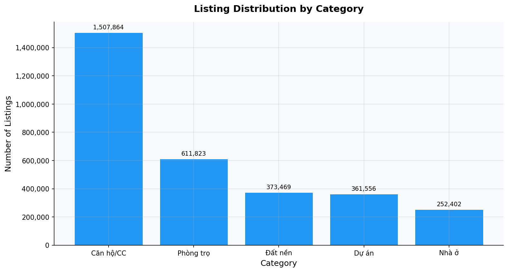
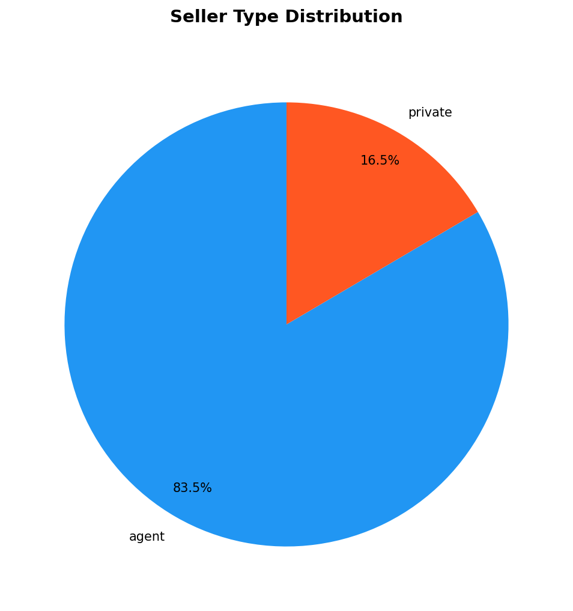
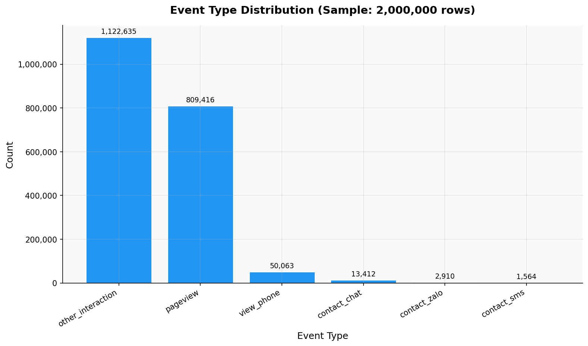
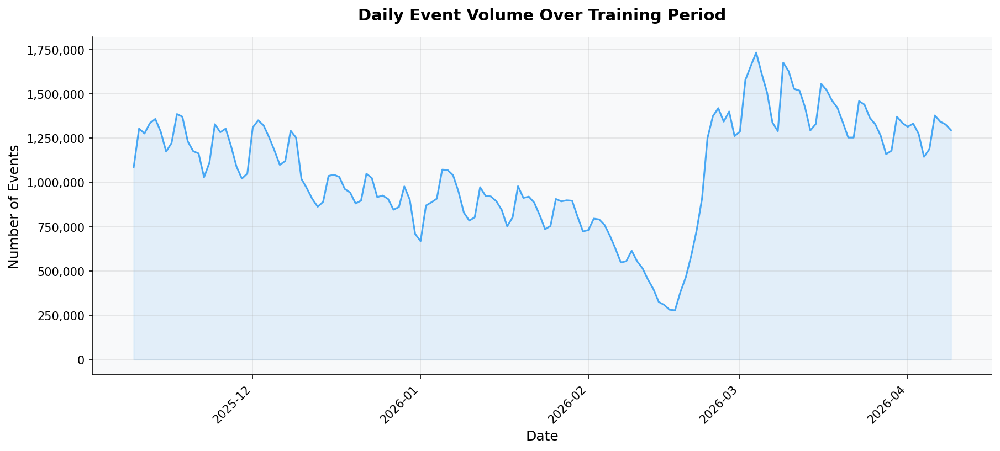
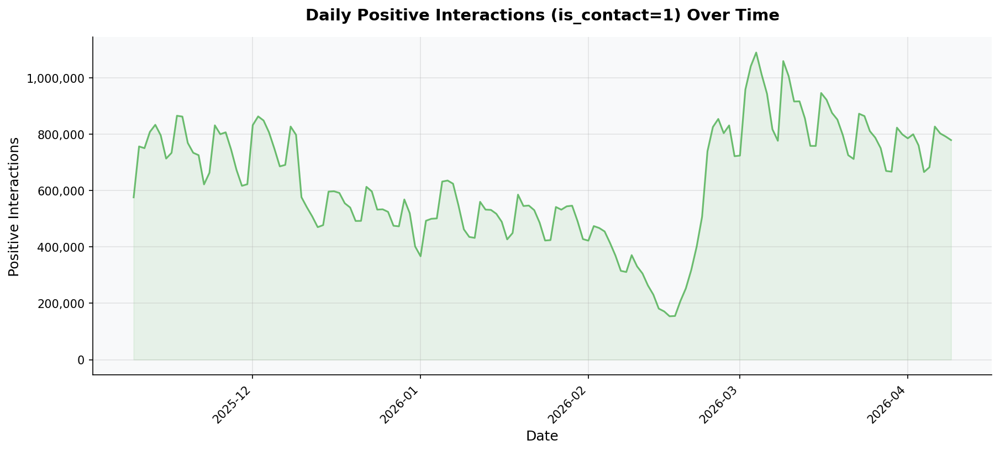
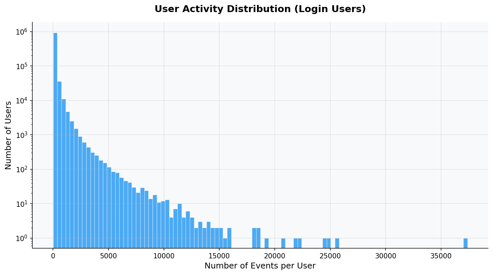
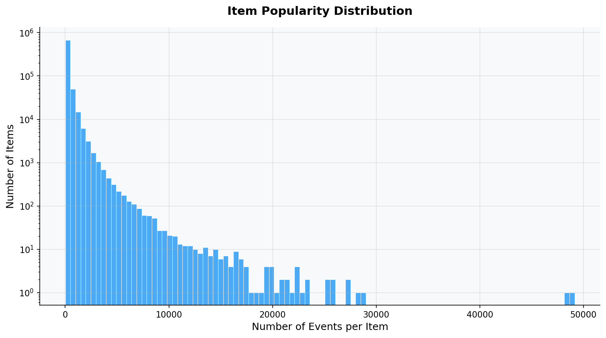
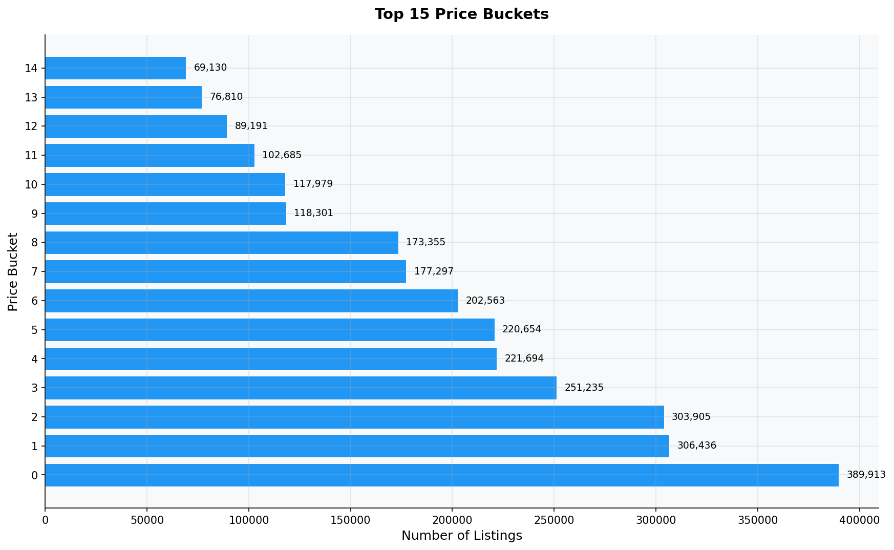
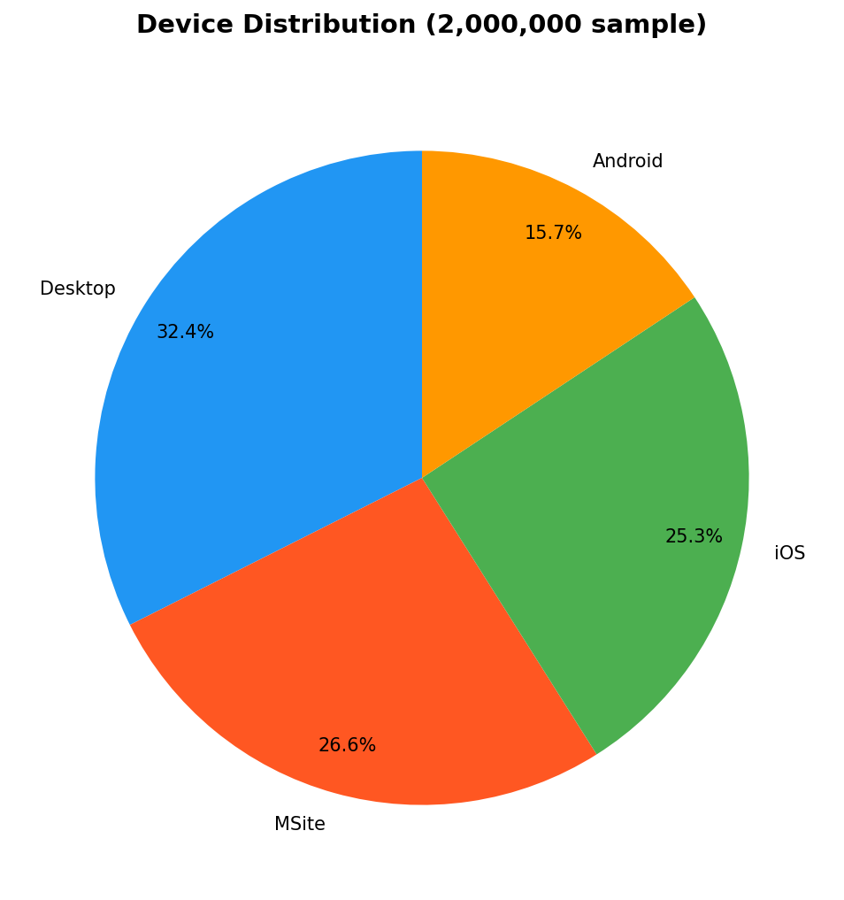
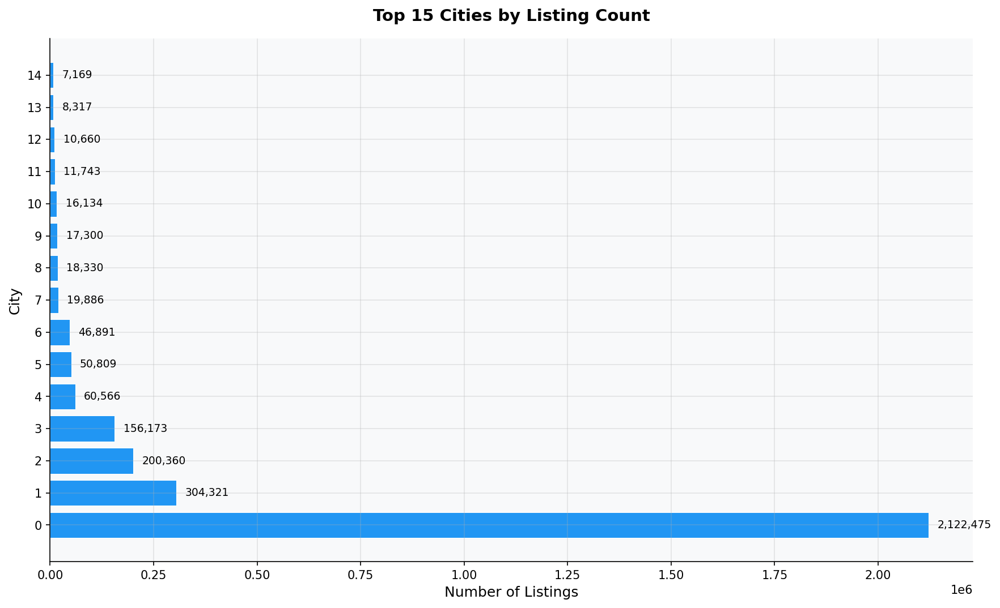

# Round 03 Report: Basic Distributions & Statistical Overview

## Executive Summary
Analyzed distributions across 9 dimensions. Key findings: strong power-law in user activity,
long-tail item popularity, and clear temporal patterns in daily event volume.

## Methodology
- Plots generated via `src/utils/plotting.py` module
- Full `fact_user_events` used for temporal/aggregation queries (lazy evaluation)
- 2M sample used for per-event distributions
- All figures saved to `src/eda/reports/figures/round_03_*.png`

## Key Findings

### 1. Category Distribution

- Generated by: `src/eda/round_03_distributions.py` (line ~70)
- Data: `dim_listing` (3,107,114 rows)
- Top: Căn hộ/CC (1,507,864), Phòng trọ (611,823)

### 2. Seller Type Distribution

- Generated by: `src/eda/round_03_distributions.py` (line ~90)
- Agent: 83.5%, Private: 16.5%
- **Observation**: Agent dominates. Fairness metric must account for this natural imbalance.

### 3. Event Type Distribution

- Generated by: `src/eda/round_03_distributions.py` (line ~110)
- Sample: 2,000,000 rows from fact_user_events
- Positive interaction rate (is_contact=1): **59.53%** (1,190,584/2,000,000)
- Most frequent: `other_interaction` (1,122,635)

### 4. Daily Event Volume Over Time

- Generated by: `src/eda/round_03_distributions.py` (line ~140-170)
- Data: Full `fact_user_events` (lazy aggregation, no sampling)
- Train period: 2025-11-09 to 2026-04-09 (152 days)
- Avg daily events: 1,064,022
- Avg daily positive: 632,779

### 5. User Activity Distribution

- Generated by: `src/eda/round_03_distributions.py` (line ~190)
- Data: Full `fact_user_events` (login users only, lazy aggregation)
- Total login users: 994,892
- Median events/user: 21
- P90 events/user: 235
- P99 events/user: 1271
- **Pattern**: Strong right-skew (power law). Most users have few events, small minority has thousands.

### 6. Item Popularity Distribution

- Generated by: `src/eda/round_03_distributions.py` (line ~230)
- Data: Full `fact_user_events` (lazy aggregation)
- Total items with events: 758,546
- Median events/item: 76
- P90 events/item: 508
- P99 events/item: 2070
- **Pattern**: Classic long-tail. Most items get very few interactions.

### 7. Price Bucket Distribution

- Generated by: `src/eda/round_03_distributions.py` (line ~260)
- Data: `dim_listing` (3,107,114 rows)

### 8. Device Distribution

- Generated by: `src/eda/round_03_distributions.py` (line ~285)
- Sample: 2,000,000 rows from fact_user_events

### 9. Top Cities by Listing Count

- Generated by: `src/eda/round_03_distributions.py` (line ~305)
- Data: `dim_listing` (3,107,114 rows)
- Total cities: 63

## Hypotheses Generated
- **H-005**: Weekend/holiday patterns differ significantly from weekdays (visible in daily volume chart). → Verify in Round 05 (User Journey).
- **H-006**: Top 1% of items receive disproportionate traffic (Pareto effect). → Verify in Round 07 (Listing Quality).
- **H-007**: HCM and Hanoi dominate >60% of listings. Geographic concentration may cause cold-start for users in smaller cities. → Verify in Round 06.

## Code Reference
- Code: `src/eda/round_03_distributions.py`
- Modules used: `src/utils/profiler.py`, `src/utils/plotting.py`, `src/utils/report_writer.py`
- Figures directory: `src/eda/reports/figures/`

## Next Steps
Phase 1 Synthesis: Consolidate all insights from Rounds 01-03 into initial hypotheses list.
Then proceed to Phase 2: Deep Dive (User Behavior Analysis, Round 04).
