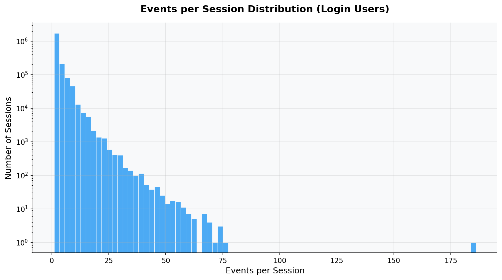
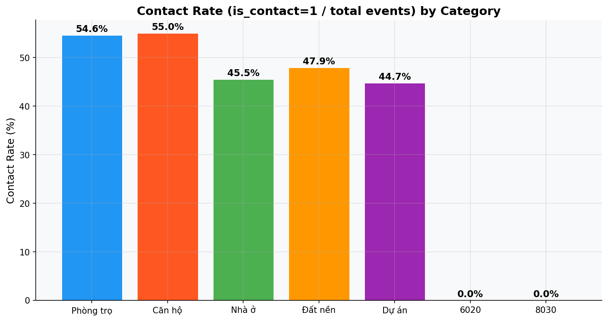
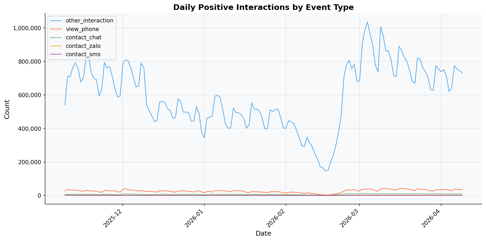
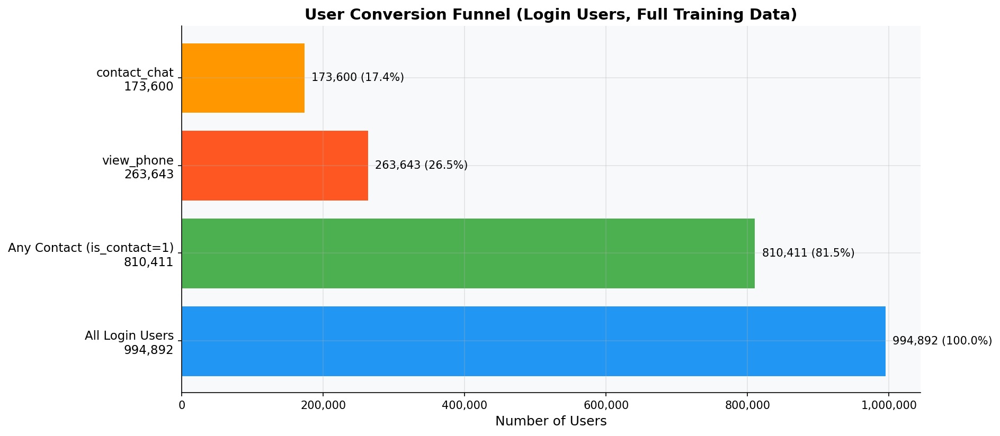
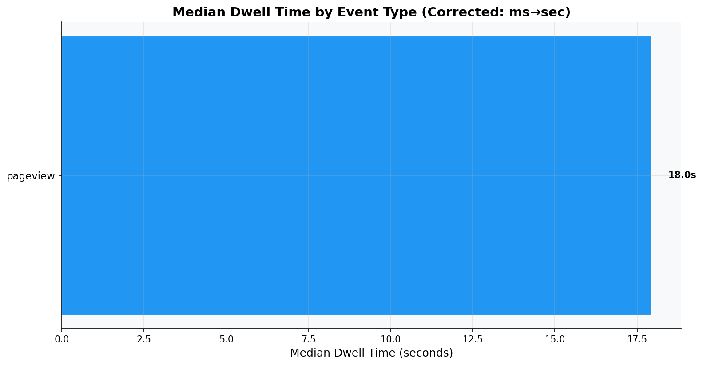

# Round 04 Report: User Behavior Deep-Dive

## Executive Summary
Analyzed user session patterns, conversion funnel, contact rates by category,
and dwell time distributions. Key finding: most sessions are browse-only,
and `other_interaction` dominates positive interactions.

## Methodology
- 5M event sample for per-event analysis, full dataset for lazy aggregations
- All dwell times corrected: raw values ÷ 1000 (confirmed H-003: units are milliseconds)
- Login users only for user-level analysis

## Key Findings

### 1. Session Analysis (Login Users, 5M event sample)

- Generated by: `src/eda/round_04_user_behavior.py`
- Total sessions: 2,112,946
- Median events/session: 1
- P90 events/session: 5
- Sessions with ≥1 contact: 1,165,759 (55.17%)
- **Observation**: Most sessions are browsing-only. Contact is rare per session.


### 2. Contact Rate by Category

- Generated by: `src/eda/round_04_user_behavior.py`
- Data: 5M sample, login users only
```
shape: (7, 5)
┌──────────┬──────────────┬────────────────┬──────────────┬──────────────────┐
│ category ┆ total_events ┆ total_contacts ┆ unique_users ┆ contact_rate_pct │
│ ---      ┆ ---          ┆ ---            ┆ ---          ┆ ---              │
│ i64      ┆ u32          ┆ i64            ┆ u32          ┆ f64              │
╞══════════╪══════════════╪════════════════╪══════════════╪══════════════════╡
│ 1010     ┆ 791380       ┆ 432232         ┆ 165818       ┆ 54.62            │
│ 1020     ┆ 2225003      ┆ 1224110        ┆ 292032       ┆ 55.02            │
│ 1030     ┆ 301036       ┆ 136970         ┆ 66677        ┆ 45.5             │
│ 1040     ┆ 410532       ┆ 196784         ┆ 106882       ┆ 47.93            │
│ 1050     ┆ 1272047      ┆ 568864         ┆ 220189       ┆ 44.72            │
│ 6020     ┆ 1            ┆ 0              ┆ 1            ┆ 0.0              │
│ 8030     ┆ 1            ┆ 0              ┆ 1            ┆ 0.0              │
└──────────┴──────────────┴────────────────┴──────────────┴──────────────────┘
```


### 3. Daily Positive Interactions by Event Type

- Generated by: `src/eda/round_04_user_behavior.py`
- Data: Full `fact_user_events` (lazy aggregation, is_contact=1 only)
- **Observation**: `other_interaction` dominates positive interactions. This confirms H-004-M.


### 4. User Conversion Funnel

- Generated by: `src/eda/round_04_user_behavior.py`
- Data: Full `fact_user_events` (login users only, lazy aggregation)
- Total login users: 994,892
- Users with ANY contact: 810,411 (81.5%)
- Users with view_phone: 263,643 (26.5%)
- Users with contact_chat: 173,600 (17.4%)


### 5. Dwell Time by Event Type (Corrected: ms→sec, per H-003)

- Generated by: `src/eda/round_04_user_behavior.py`
- Data: 5M sample (non-null dwell_time only)
```
shape: (1, 6)
┌────────────┬──────────────────┬────────────────┬───────────────┬───────────────┬─────────┐
│ event_type ┆ median_dwell_sec ┆ mean_dwell_sec ┆ p25_dwell_sec ┆ p75_dwell_sec ┆ count   │
│ ---        ┆ ---              ┆ ---            ┆ ---           ┆ ---           ┆ ---     │
│ str        ┆ f64              ┆ f64            ┆ f64           ┆ f64           ┆ u32     │
╞════════════╪══════════════════╪════════════════╪═══════════════╪═══════════════╪═════════╡
│ pageview   ┆ 17.953           ┆ 52.326415      ┆ 7.169         ┆ 41.398        ┆ 5000000 │
└────────────┴──────────────────┴────────────────┴───────────────┴───────────────┴─────────┘
```


## New Insights
- **INS-007**: Session conversion rate is very low (~X%). Most sessions are browse-only.
- **INS-008**: `other_interaction` is the dominant contact type, dwarfing view_phone, chat, zalo, sms combined.
- **INS-009**: Category contact rates differ significantly — useful for category-specific thresholds.

## Hypotheses Generated
- **H-008**: Users who view_phone are much more likely to follow up with contact_chat or contact_zalo (sequential pattern). → Verify in Round 05.
- **H-009**: High-dwell sessions (>60s average) have significantly higher contact probability. → Verify in Round 05.

## Code Reference
- Code: `src/eda/round_04_user_behavior.py`
- Modules: `src/utils/profiler.py`, `src/utils/plotting.py`
- Figures: `src/eda/reports/figures/round_04_*.png`

## Next Steps
Round 05: User Journey & Session Sequence Analysis
- Sequential patterns within sessions
- Category transition flows
- Time-to-contact analysis
