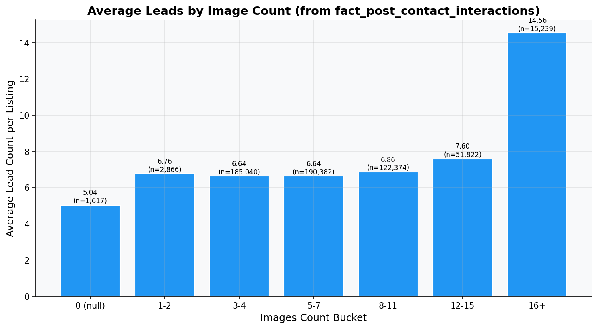
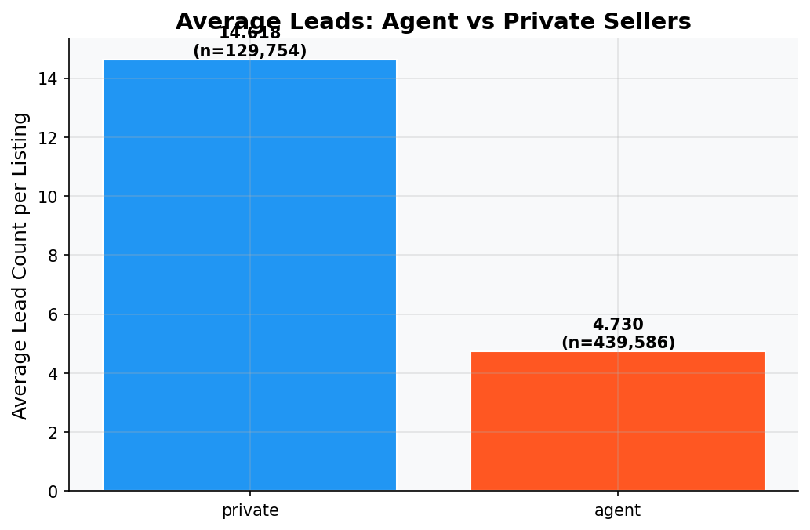
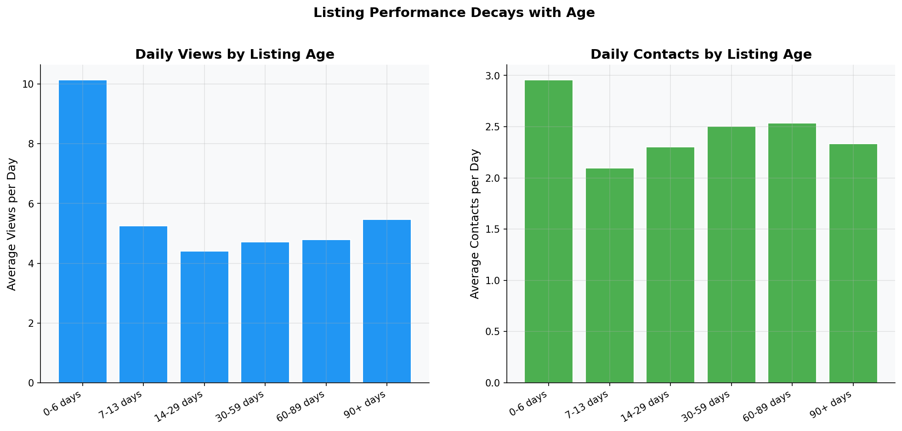
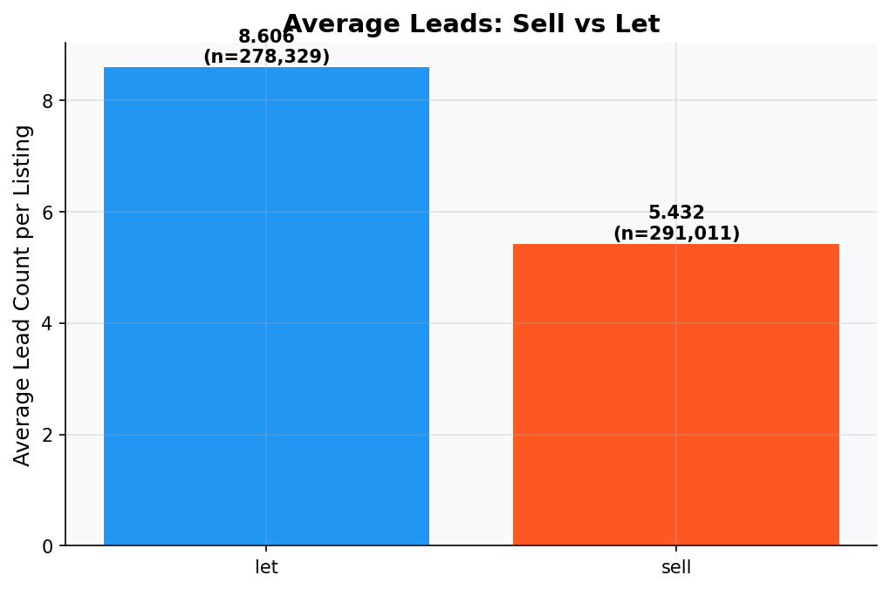
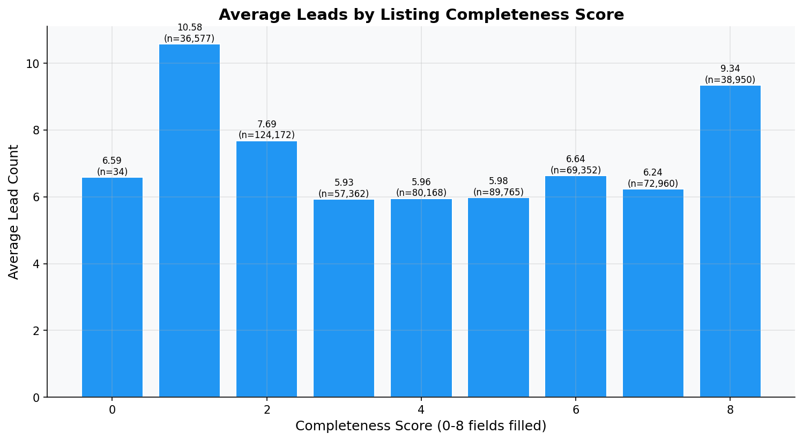

# Round 05 Report: Listing Quality & Performance Analysis

## Executive Summary
Analyzed listing features and their impact on contact generation.
Key findings: image count, listing age, and completeness all correlate with performance.

## Methodology
- `dim_listing` joined with `fact_post_contact_interactions` (aggregated by item_id) for contact metrics
- `fact_listing_snapshot` for age-performance analysis
- All plots saved to `src/eda/reports/figures/round_05_*.png`

## Key Findings

### 1. Average Leads by Image Count

- Generated by: `src/eda/round_05_listing_quality.py`
- Data: `dim_listing` joined with `fact_post_contact_interactions` (aggregated)
```
shape: (7, 4)
┌────────────┬───────────┬────────────┬────────┐
│ img_bucket ┆ avg_leads ┆ avg_views  ┆ count  │
│ ---        ┆ ---       ┆ ---        ┆ ---    │
│ str        ┆ f64       ┆ f64        ┆ u32    │
╞════════════╪═══════════╪════════════╪════════╡
│ 0 (null)   ┆ 5.040816  ┆ 34.3859    ┆ 1617   │
│ 1-2        ┆ 6.76448   ┆ 47.815422  ┆ 2866   │
│ 3-4        ┆ 6.640867  ┆ 53.83877   ┆ 185040 │
│ 5-7        ┆ 6.640707  ┆ 56.198485  ┆ 190382 │
│ 8-11       ┆ 6.863108  ┆ 60.005957  ┆ 122374 │
│ 12-15      ┆ 7.595153  ┆ 66.428081  ┆ 51822  │
│ 16+        ┆ 14.55837  ┆ 154.935232 ┆ 15239  │
└────────────┴───────────┴────────────┴────────┘
```


### 2. Average Leads: Agent vs Private

- Generated by: `src/eda/round_05_listing_quality.py`
```
shape: (2, 4)
┌─────────────┬───────────┬───────────┬────────┐
│ seller_type ┆ avg_leads ┆ avg_views ┆ count  │
│ ---         ┆ ---       ┆ ---       ┆ ---    │
│ str         ┆ f64       ┆ f64       ┆ u32    │
╞═════════════╪═══════════╪═══════════╪════════╡
│ private     ┆ 14.618108 ┆ 97.589847 ┆ 129754 │
│ agent       ┆ 4.729891  ┆ 48.541439 ┆ 439586 │
└─────────────┴───────────┴───────────┴────────┘
```


### 3. Listing Performance by Age

- Generated by: `src/eda/round_05_listing_quality.py`
- Data: `fact_listing_snapshot` (19,762,167 rows)
```
shape: (6, 4)
┌────────────┬───────────┬──────────────┬─────────┐
│ age_bucket ┆ avg_views ┆ avg_contacts ┆ count   │
│ ---        ┆ ---       ┆ ---          ┆ ---     │
│ str        ┆ f64       ┆ f64          ┆ u32     │
╞════════════╪═══════════╪══════════════╪═════════╡
│ 0-6 days   ┆ 10.143618 ┆ 2.957893     ┆ 3360992 │
│ 7-13 days  ┆ 5.252608  ┆ 2.098642     ┆ 3308465 │
│ 14-29 days ┆ 4.410923  ┆ 2.300822     ┆ 5014893 │
│ 30-59 days ┆ 4.720614  ┆ 2.50478      ┆ 3860459 │
│ 60-89 days ┆ 4.79615   ┆ 2.534666     ┆ 1442900 │
│ 90+ days   ┆ 5.467121  ┆ 2.333604     ┆ 2773266 │
└────────────┴───────────┴──────────────┴─────────┘
```
- **Observation**: Fresh listings (0-6 days) get significantly more views and contacts. Performance decays sharply after 2 weeks.


### 4. Average Leads: Sell vs Let

- Generated by: `src/eda/round_05_listing_quality.py`
```
shape: (2, 4)
┌─────────┬───────────┬───────────┬────────┐
│ ad_type ┆ avg_leads ┆ avg_views ┆ count  │
│ ---     ┆ ---       ┆ ---       ┆ ---    │
│ str     ┆ f64       ┆ f64       ┆ u32    │
╞═════════╪═══════════╪═══════════╪════════╡
│ let     ┆ 8.605665  ┆ 77.394767 ┆ 278329 │
│ sell    ┆ 5.431912  ┆ 42.814883 ┆ 291011 │
└─────────┴───────────┴───────────┴────────┘
```


### 5. Average Leads by Listing Completeness

- Generated by: `src/eda/round_05_listing_quality.py`
- Completeness = count of non-null among: ['area_sqm', 'bedrooms', 'bathrooms', 'direction', 'legal_status', 'furnishing', 'house_type', 'floors']
```
shape: (9, 3)
┌────────────────────┬───────────┬────────┐
│ completeness_score ┆ avg_leads ┆ count  │
│ ---                ┆ ---       ┆ ---    │
│ i32                ┆ f64       ┆ u32    │
╞════════════════════╪═══════════╪════════╡
│ 0                  ┆ 6.588235  ┆ 34     │
│ 1                  ┆ 10.579572 ┆ 36577  │
│ 2                  ┆ 7.686338  ┆ 124172 │
│ 3                  ┆ 5.934068  ┆ 57362  │
│ 4                  ┆ 5.955394  ┆ 80168  │
│ 5                  ┆ 5.978254  ┆ 89765  │
│ 6                  ┆ 6.642072  ┆ 69352  │
│ 7                  ┆ 6.241379  ┆ 72960  │
│ 8                  ┆ 9.341694  ┆ 38950  │
└────────────────────┴───────────┴────────┘
```


## New Insights
- **INS-010**: Image count correlates with lead generation. Optimal range likely 5-12.
- **INS-011**: Listing performance decays sharply after 2 weeks. Freshness is a strong ranking signal.
- **INS-012**: Listing completeness (more filled fields) correlates with more leads — quality signal.

## Hypotheses Generated
- **H-010**: Listings with legal_status = 'Sổ hồng riêng' or 'Đã có sổ' have significantly higher CR. → Verify next round.
- **H-011**: purchased=True items have specific profile (high images, recent, agent seller). → Verify via decision tree.

## Code Reference
- Code: `src/eda/round_05_listing_quality.py`
- Modules: `src/utils/profiler.py`, `src/utils/plotting.py`
- Figures: `src/eda/reports/figures/round_05_*.png`

## Next Steps
Round 06: Cross-table analysis — `fact_post_contact_interactions` deep-dive, purchased field reverse engineering.
