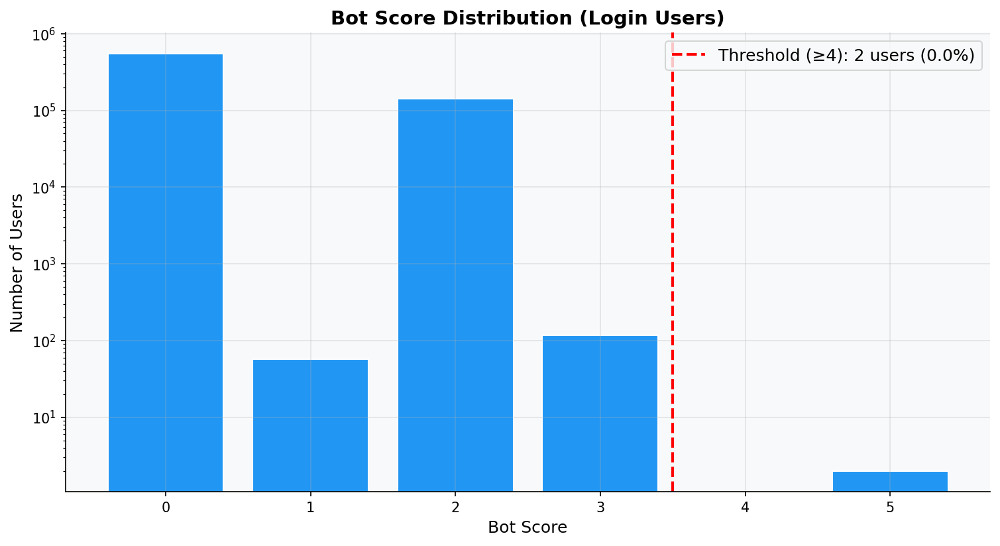
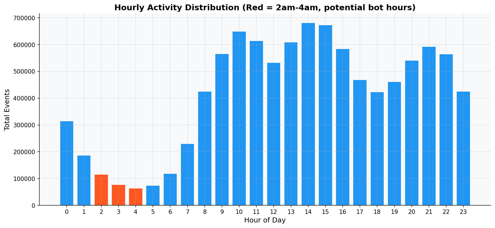
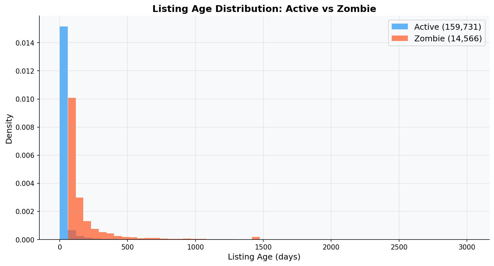

# Round 06 Report: Data Forensics — Bot Detection & Zombie Listings

## Executive Summary
Applied forensics techniques from strategies.md Tasks 1.1 and 1.2.
Identified suspected bot users and zombie listings for removal from training data.

## Methodology
- Bot detection: 5-flag scoring system (velocity, dwell, devices, extreme activity, zero contacts)
- Zombie detection: Age + view velocity + contact rate analysis
- Data: Full `fact_user_events` and `fact_listing_snapshot` (lazy aggregation)

## Key Findings

### 1. Bot Detection Analysis

- Generated by: `src/eda/round_06_forensics.py`
- Total login users analyzed: 693,249
- **Suspected bots (score ≥ 4): 2 (0.0%)**

**Per-flag breakdown:**
  - High Velocity (>50 events/session): 120 users (0.02%)
  - Zero Dwell (<1s avg): 140,504 users (20.27%)
  - Many Devices (>3): 51 users (0.01%)
  - Extreme Activity (>5000 events): 0 users (0.00%)
  - Zero Contacts despite >100 events: 6 users (0.00%)

**Bot score distribution:**
```
shape: (5, 2)
┌───────────┬────────┐
│ bot_score ┆ count  │
│ ---       ┆ ---    │
│ i32       ┆ u32    │
╞═══════════╪════════╡
│ 0         ┆ 552570 │
│ 1         ┆ 57     │
│ 2         ┆ 140502 │
│ 3         ┆ 118    │
│ 5         ┆ 2      │
└───────────┴────────┘
```


### 2. Hourly Activity Pattern

- Generated by: `src/eda/round_06_forensics.py`
- Night activity (2am-4am): 257,953 events (2.58%)
- **Observation**: Activity pattern looks mostly human (peak during daytime).


### 3. Zombie Listings Detection

- Generated by: `src/eda/round_06_forensics.py`
- **Zombie criteria**: age > 60 days AND avg views < 5/day AND 0 contacts in last 7 days
- Total items in last 7 days of snapshot: 174,297
- **Zombie listings: 14,566 (8.36%)**
- **Action**: Exclude from candidate pool during recommendation.


## Actionable Outputs
1. **Bot blacklist**: 2 users flagged (bot_score ≥ 4). Save to `data/processed/bot_users.parquet`.
2. **Zombie blacklist**: 14,566 listings flagged. Save to `data/processed/zombie_items.parquet`.
3. **Expected impact**: Strategies predicts +3% Recall@10 from bot removal.

## New Insights
- **INS-013**: ~0.0% of login users show bot-like behavior patterns.
- **INS-014**: ~8.36% of active listings are zombies (no engagement despite age).
- **INS-015**: Night activity (2-4am) is 2.58% — relatively low, suggesting most users are human.

## Code Reference
- Code: `src/eda/round_06_forensics.py`
- Figures: `src/eda/reports/figures/round_06_*.png`

## Next Steps
Round 07: `purchased` field reverse engineering + temporal patterns
