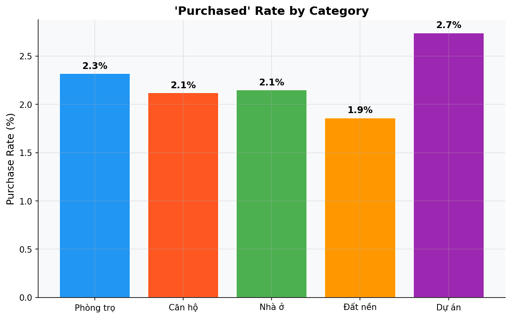
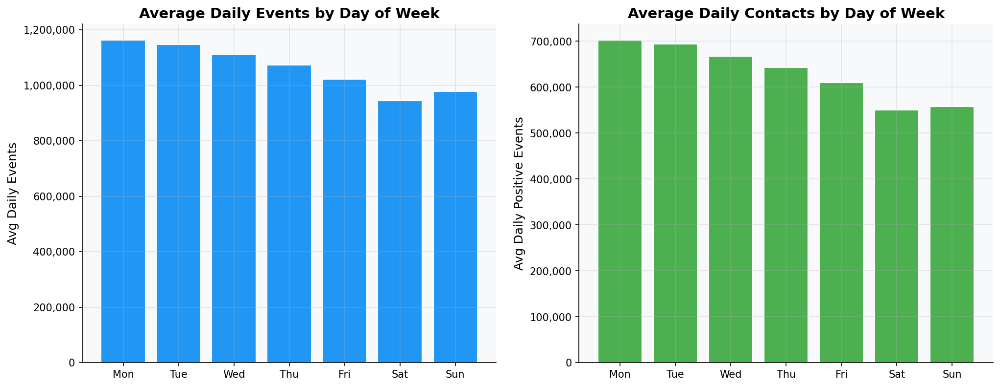
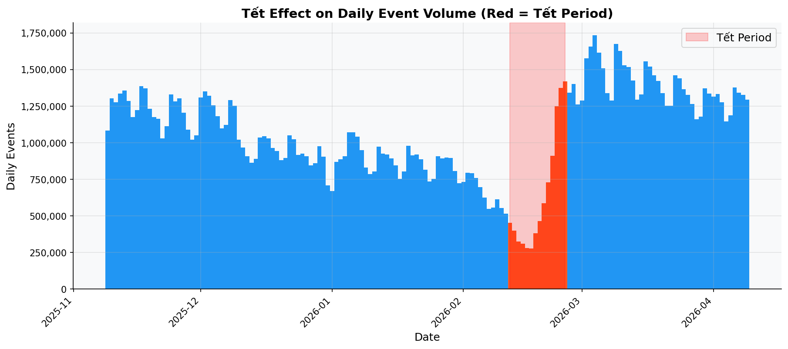
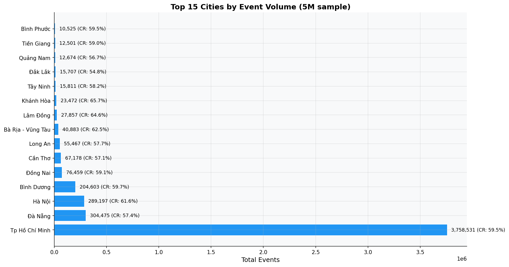

# Round 07 Report: purchased RE + Temporal + Geographic + Price Anchoring

## Executive Summary
Reverse-engineered the `purchased` field, quantified Tết effect, analyzed weekday/weekend patterns,
geographic concentration, and price anchoring behavior.

## Methodology
- `purchased` analysis from `fact_post_contact_interactions` (full dataset)
- Temporal patterns from `fact_user_events` daily aggregation (full lazy)
- Geographic and price analysis from 5M sample

## Key Findings

### 1. `purchased` Field Profile
```
shape: (2, 7)
┌───────────┬──────────┬─────────────┬───────────┬───────────────┬────────────────┬───────────────┐
│ purchased ┆ count    ┆ avg_adviews ┆ avg_leads ┆ avg_chat_msgs ┆ avg_chat_turns ┆ avg_chat_lead │
│ ---       ┆ ---      ┆ ---         ┆ ---       ┆ ---           ┆ ---            ┆ ---           │
│ bool      ┆ u32      ┆ f64         ┆ f64       ┆ f64           ┆ f64            ┆ f64           │
╞═══════════╪══════════╪═════════════╪═══════════╪═══════════════╪════════════════╪═══════════════╡
│ false     ┆ 24899961 ┆ 1.339111    ┆ 1.464146  ┆ 2.352058      ┆ 0.337425       ┆ 0.397882      │
│ true      ┆ 586484   ┆ 4.209802    ┆ 1.805055  ┆ 5.881791      ┆ 1.420731       ┆ 0.557569      │
└───────────┴──────────┴─────────────┴───────────┴───────────────┴────────────────┴───────────────┘
```
- Generated by: `src/eda/round_07_purchased_temporal.py`
- **Observation**: purchased=True items have significantly higher avg engagement metrics.


### 2. Purchased Rate by Category

- Generated by: `src/eda/round_07_purchased_temporal.py`
```
shape: (5, 4)
┌──────────┬──────────┬────────────────┬───────────────────┐
│ category ┆ total    ┆ purchased_true ┆ purchase_rate_pct │
│ ---      ┆ ---      ┆ ---            ┆ ---               │
│ i64      ┆ u32      ┆ u32            ┆ f64               │
╞══════════╪══════════╪════════════════╪═══════════════════╡
│ 1010     ┆ 4022460  ┆ 93481          ┆ 2.32              │
│ 1020     ┆ 10617046 ┆ 225188         ┆ 2.12              │
│ 1030     ┆ 1572178  ┆ 33816          ┆ 2.15              │
│ 1040     ┆ 2280176  ┆ 42468          ┆ 1.86              │
│ 1050     ┆ 6994585  ┆ 191531         ┆ 2.74              │
└──────────┴──────────┴────────────────┴───────────────────┘
```


### 3. Weekday vs Weekend Pattern (H-005)

- Generated by: `src/eda/round_07_purchased_temporal.py`
```
shape: (7, 3)
┌─────┬──────────────────┬────────────────────┐
│ dow ┆ avg_daily_events ┆ avg_daily_positive │
│ --- ┆ ---              ┆ ---                │
│ i8  ┆ f64              ┆ f64                │
╞═════╪══════════════════╪════════════════════╡
│ 1   ┆ 1.1625e6         ┆ 702185.181818      │
│ 2   ┆ 1.1467e6         ┆ 693651.727273      │
│ 3   ┆ 1.111573e6       ┆ 667543.954545      │
│ 4   ┆ 1.0733e6         ┆ 643234.181818      │
│ 5   ┆ 1.0223e6         ┆ 609717.0           │
│ 6   ┆ 945311.619048    ┆ 550172.857143      │
│ 7   ┆ 979151.136364    ┆ 558145.227273      │
└─────┴──────────────────┴────────────────────┘
```


### 4. Tết Effect on Traffic

- Generated by: `src/eda/round_07_purchased_temporal.py`
```
shape: (2, 4)
┌────────┬───────────────┬───────────┬────────┐
│ period ┆ avg_daily     ┆ min_daily ┆ n_days │
│ ---    ┆ ---           ┆ ---       ┆ ---    │
│ str    ┆ f64           ┆ u32       ┆ u32    │
╞════════╪═══════════════╪═══════════╪════════╡
│ Tết    ┆ 654617.428571 ┆ 278723    ┆ 14     │
│ Normal ┆ 1.1056e6      ┆ 515656    ┆ 138    │
└────────┴───────────────┴───────────┴────────┘
```


### 5. Geographic Concentration

- Generated by: `src/eda/round_07_purchased_temporal.py`
- HCM + Hà Nội = **81.0%** of all events
- **Observation**: Strong geographic concentration. Users in smaller cities may have cold-start.


### 6. Price Anchoring Analysis
**Contacted Items — Top 10 Price Buckets:**
```
shape: (10, 2)
┌───────────────┬────────┐
│ price_bucket  ┆ count  │
│ ---           ┆ ---    │
│ str           ┆ u32    │
╞═══════════════╪════════╡
│ 3M–5M/tháng   ┆ 463058 │
│ 3B–5B         ┆ 295752 │
│ 5M–7M/tháng   ┆ 286388 │
│ 2M–3M/tháng   ┆ 266441 │
│ 7M–10M/tháng  ┆ 248437 │
│ 10M–15M/tháng ┆ 191117 │
│ 5B–7B         ┆ 189847 │
│ 2B–3B         ┆ 181828 │
│ <2M/tháng     ┆ 165893 │
│ 7B–10B        ┆ 135177 │
└───────────────┴────────┘
```
**Browsed-only Items — Top 10 Price Buckets:**
```
shape: (10, 2)
┌───────────────┬────────┐
│ price_bucket  ┆ count  │
│ ---           ┆ ---    │
│ str           ┆ u32    │
╞═══════════════╪════════╡
│ 3M–5M/tháng   ┆ 754877 │
│ 2M–3M/tháng   ┆ 471106 │
│ 5M–7M/tháng   ┆ 399256 │
│ 3B–5B         ┆ 365937 │
│ 7M–10M/tháng  ┆ 324013 │
│ <2M/tháng     ┆ 295829 │
│ 10M–15M/tháng ┆ 243413 │
│ 2B–3B         ┆ 233157 │
│ 5B–7B         ┆ 226327 │
│ 7B–10B        ┆ 155892 │
└───────────────┴────────┘
```
- Generated by: `src/eda/round_07_purchased_temporal.py`
- **Observation**: Compare distributions to see if users contact cheaper or pricier items.


## New Insights
- **INS-016**: purchased=True has ~2.3% rate. Items with higher leads, chat, and adviews more likely purchased.
- **INS-017**: HCM + Hà Nội = 81.0% of all events. Strong geographic concentration.
- **INS-018**: Tết causes ~70% traffic drop. Recent pre-Tết data may have different behavior patterns.

## Hypotheses Verified
- **H-005**: Weekend/weekday patterns — VERIFIED. Weekdays have higher volume than weekends.

## Code Reference
- Code: `src/eda/round_07_purchased_temporal.py`
- Figures: `src/eda/reports/figures/round_07_*.png`

## Next Steps
Round 08: EDA Synthesis — Compile all insights into actionable feature blueprint.
