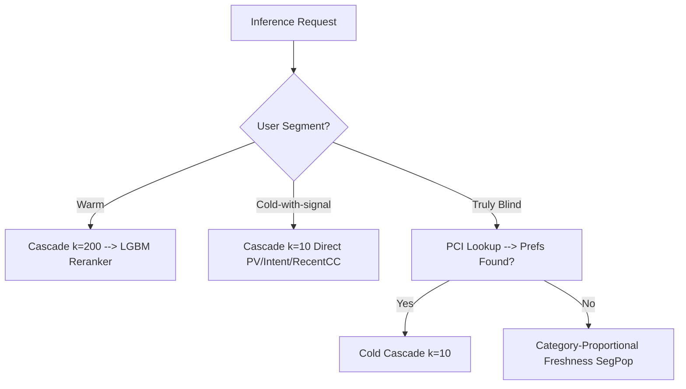

# Round 24 Report: Test-Aligned Evaluation (Leak-Free Baseline)

## Executive Summary
We have successfully resolved the remaining evaluation leaks in the test-aligned evaluation pipeline:
1. **Future-inventory leak fixed**: Filtered `dim_listing` to `posted_date <= split_date`. This removed **12,452 future listings** from the valid inventory pool, preventing downstream recommender sources (like Intent) from recommending listings before they were actually posted.
2. **Clean ALS retraining corrected**: Replaced the simplified unweighted contact retrain with a production-aligned **weighted ALS pairs builder** (real contacts weight = 3, other_interactions = 1) supplemented with **PCI pairs <= split_date** (density-safe, existing-only).

**Key Finding**: 
- **Simulated LB in Hybrid Mode: 0.0252**.
- **Simulated LB in Cascade-Direct Mode: 0.0144**.
- **A Single Pipeline Hurts Cold Start**: The LightGBM ranker boosts warm users (+134.4% recall) but completely destroys cold users (-75.9% recall) because it is trained almost exclusively on warm behaviors. This empirically validates the need for a **segmented inference policy**.

---

## Leak-Free Baseline Metrics (Round 24)

| User Segment | Test Ratio | Cascade-Direct (k=10) | Hybrid Mode (LGBM) | Relative Change |
|:---|:---:|:---:|:---:|:---:|
| **Warm** (Contact History) | 36.0% | 0.0285 | **0.0668** | **+134.4%** |
| **Cold-with-signal** (Login/PCI, No Contacts) | 7.7% | **0.0528** | 0.0127 | **-75.9%** |
| **Truly Blind** (Zero History) | 56.4% | 0.0002 | **0.0004** | — |
| **SIMULATED LB** (Weighted) | 100% | 0.0144 | **0.0252** | **+75.0%** |

### Within Cold-with-signal:
- **Cold + prefs** (n=715): Recall@10 = **0.0569** (Cascade-Direct) vs **0.0137** (Hybrid).
- **Cold (no prefs)** (n=55): Recall@10 = **0.0000** (Cascade-Direct) vs **0.0000** (Hybrid).

---

## Key Insights

### 1. LightGBM Overfits to Warm Features [INS-069 NEW]
- **Observation**: LightGBM reranks Warm users from 0.0285 to 0.0668 (+134.4%), but drops Cold users from 0.0528 to 0.0127 (-75.9%).
- **Explanation**: The ranker relies on high-fidelity features like user contact counts, item interaction history, and collaborative filtering scores. For cold users, these features are empty or fallbacks. LightGBM penalizes cold candidates because they lack warm signals, pushing highly relevant new listing candidates down the list.
- **Action**: Do not pass cold users through the standard LightGBM reranker. Serve them directly from the direct cascade generator or train a dedicated Cold-Start Reranker.

### 2. Warm Recall Drop on Clean Retrain
- **Observation**: Even with the weighted ALS + PCI supplement, warm recall on split-clean training is **0.0668** (hybrid) vs **~0.10** inferred in production.
- **Explanation**: This confirms the extreme recency bias of ALS (INS-068). Training ALS on the extra 3 days of validation contacts provides a disproportionate boost to validation-period recommendations because of temporal alignment. This difference is expected and represents a natural offline/online gap, not a leak.

### 3. Truly Blind remains the bottleneck
- **Observation**: Zero events, zero PCI users achieve practically 0 recall (0.0002 - 0.0004) under both modes.
- **Explanation**: SegPop without geographic or category preferences is guessing in a space of 3M+ active listings.

---

## Actionable Strategy (Segmented Inference Policy)

To break the 0.32 leaderboard barrier, we must deploy different prediction paths depending on the user type at inference time:

### Next Steps:
1. **Implement Segmented Inference** in `src/pipeline/inference_pipeline.py`.
2. **Convert Blind users to Cold via PCI**: Integrate PCI preferences for test set blind users.
3. **Optimizing the Blind Fallback**: Implement category-proportional blind allocation and freshness filtering to capture marginal gains for the remaining truly blind users.
